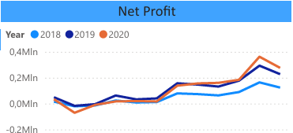

# Financial Performance and Budget Analysis Using PowerBI

## Introduction

This report presents a detailed analysis of a company's financial performance and budget comparisons using Power BI. The analysis focuses on profit and loss, balance sheet, ledgers, and horizontal analysis across multiple years. Additionally, a secondary analysis is conducted to compare actual performance with budgeted values. The data spans multiple financial years and territories, providing a comprehensive view of the company's financial health and growth trends.

## Objectives

The primary objectives of the analysis are to:

- **Profit and Loss (P&L)**: Analyze the company's revenue, expenses, and profits across different accounts, sub-accounts, and regions. Compute key profitability metrics like EBITDA, gross profit margin, and net profit margin.
- **Balance Sheet (BS)**: Assess the company's assets, liabilities, and owner's equity. Evaluate key financial ratios such as current ratio, quick ratio, return on capital employed (ROCE), return on equity (ROE), and gearing ratio.
- **Ledgers**: Track financial performance over time with filters for country, date, and account.
- **Horizontal Analysis**: Analyze the percentage gain or loss in profit and balance sheet accounts over the years.
- **Budget vs Actual**: Compare the actual financial performance to the budgeted figures for sales and P&L on a quarterly basis.

## Data Description
The analysis is based on two primary datasets: **Business Data** and **Budget Data**. Each dataset is organized across multiple sheets providing details on general ledger entries, calendar information, chart of accounts, and territory mapping. These datasets are critical to understanding the financial performance and comparison between actual and budgeted data.

### Dataset 1: Business Data

1. **GL (General Ledger)**:
   - Contains detailed financial records related to various accounts and transactions.
   - **Columns**:
     - `Account_key`: Unique identifier for each account.
     - `Details`: Description of the transaction (e.g., sales, expenses).
     - `Amount`: Monetary value associated with the transaction.

2. **Calendar**:
   - Contains date-related information to link transactions with specific time periods.
   - **Columns**:
     - `Date`: Exact date of the transaction.
     - `Year`: Year in which the transaction took place.
     - `Quarter`: Fiscal quarter.
     - `Month`: Month of the transaction.
     - `Day`: Specific day of the transaction.

3. **Chart of Accounts**:
   - Provides a structured breakdown of all accounts used in the analysis.
   - **Columns**:
     - `Account_key`: Unique identifier for each account, used to map transactions.
     - `Report`: High-level report category.
     - `Class`: General classification (e.g., assets, liabilities, revenue).
     - `SubClass`: More detailed classification within the account.
     - `SubClass2`: Additional classification for further granularity.
     - `Account`: Account name.
     - `SubAccount`: Detailed sub-account name.

4. **Territory**:
   - Contains geographical information for transactions.
   - **Columns**:
     - `Territory_key`: Unique identifier for each geographical region.
     - `Country`: Name of the country associated with the transaction.
     - `Region`: Broader geographical region (e.g., Europe, North America).

### Dataset 2: Budget Data

1. **Budget Entries**:
   - Contains budgeted values structured similarly to the general ledger data for comparison with actual performance.
   - **Columns**:
     - `EntryNo`: Unique identifier for each budget entry.
     - `Date`: Date of the budget entry.
     - `Territory_key`: Links to the territory to identify the region for which the budget was set.
     - `Account_key`: Links to the chart of accounts for the specific budgeted account.
     - `Details`: Description of the budgeted entry.
     - `Amount`: Monetary value of the budgeted entry.
     - `Type`: Indicates whether the entry is related to actuals or budgets.

## Analysis and Commentary

### 1. Profit and Loss (P&L)

#### a. Sales Revenue Table Breakdown
 
##### Interest & Tax
- **Taxation**: Increased from -137.582 in 2018 to -279.082 in 2020. This suggests a growing tax burden on the company over the years.
- **Interest Expense**: Grew steadily from -15.840 in 2018 to -25.404 in 2020, indicating increasing debt levels or higher interest rates on existing debt.
- **Total Interest & Tax**: Similarly, the total negative impact has increased from -153.422 in 2018 to -304.486 in 2020. This reflects a growing financial cost burden on the company.

##### Non-operating Revenue
- **Gain/Loss on Sales of Assets**: This has risen from 4.850 to 6.351, indicating some growth in asset sales.
- **Interest Income**: Significant growth from 13.496 in 2018 to 30.868 in 2020, which might mean better returns on investments or increased interest-earning assets.
- **Dividend Income**: Increased from 15.917 to 30.030, which suggests the company is receiving higher dividends, possibly from investments in other companies.
- **Exchange Loss/Gain**: Increased from 2.214 to 5.016, showing positive growth in foreign exchange.
- **Total Non-operating Revenue**: This increased from 36.477 to 72.265, doubling over the period, suggesting more efficient management of non-operating income sources.

##### Operating Account
- **Amortization**: Decreased slightly from -19.008 in 2018 to -15.960 in 2020.
- **Depreciation**: Increased sharply from -387.996 to -698.880, which indicates that the company's assets (likely fixed assets) are depreciating faster as it acquires more or updates older assets.
- **Total Depreciation & Amortization**: Rose from -407.004 to -714.840, reflecting the growing capital expenditure that the company is writing off over time.

##### Operating Expenses
- **Administration Expenses**: These jumped sharply from -632.349 to -1.617.790, indicating a significant increase in administrative costs, possibly due to expansion or higher operational complexity.
- **Marketing (Commissions & Advertisements)**: Increased from -343.088 in 2018 to -959.128 in 2020, with both commissions and advertisement expenses growing substantially.
- **Sales & Distribution Expenses**: Grew from -260.004 to -527.436, likely reflecting more investment in distributing products or services as the company grows.
- **Total Operating Expenses**: Increased from -1.642.445 to -3.819.194, indicating a significant rise in the overall cost of running the company.

##### Trading Account
- **Cost of Sales**: Rose sharply from -1.192.182 to -2.494.009, indicating that the cost of producing goods or services is increasing.
- **Sales Revenue**: Grew from 3.575.428 in 2018 to 7.835.369 in 2020, showing strong sales growth.
- **Total Trading Profit**: Increased from 2.383.246 to 5.341.360, showing that the company is successfully maintaining a large gap between its cost of sales and sales revenue.

##### Overall Profitability
- The final profit figures have increased from 623.856 in 2018 to 1.289.945 in 2020. However, while there was significant growth between 2018 and 2019, the growth slowed from 2019 to 2020, indicating that the company's profits are not rising as fast as they were earlier.

#### b. Analysis of Individual Measurements

##### Gross Profit (2018–2020)
- **2018**: 2.383.246
- **2019**: 3.968.546
- **2020**: 5.341.360

Gross profit shows a healthy upward trend, indicating that the company's sales are growing at a much faster rate than the cost of goods sold (COGS). This suggests that the company is efficiently managing its production or acquisition costs, or it is pricing its goods/services effectively.

 
This plot shows that the gross profit trend is consistent across all years, with higher starting values in recent years as the company has grown. This indicates that while the company has become larger, it maintains the same growth trajectory in terms of gross profit.

##### Operating Profit (2018–2020)
- **2018**: 740.801
- **2019**: 1.475.688
- **2020**: 1.522.166

Operating profit also grows consistently, although the growth from 2019 to 2020 is marginal. The strong operating profit is driven by increased gross profit, but the slowing growth suggests that operating expenses are beginning to take a toll on the company's bottom line.

##### PBIT (Profit Before Interest and Tax) (2018–2020)
- **2018**: 777.278
- **2019**: 1.522.850
- **2020**: 1.594.431

PBIT, which accounts for interest and taxes, also shows consistent growth. However, like the operating profit, its growth slowed between 2019 and 2020, indicating rising costs related to taxation and interest.

##### Net Profit (2018–2020)
- **2018**: 623.856
- **2019**: 1.303.147
- **2020**: 1.289.945

Net profit increased significantly from 2018 to 2019 but remained relatively flat from 2019 to 2020, even declining slightly. This suggests that the combination of higher interest expenses, taxes, and operating costs in 2020 has squeezed the company’s bottom line.

  
In this plot, each year starts at the same point in Q1, but by the end of the year, 2020 shows slightly higher net profit, while 2018 has the lowest. The trend suggests that despite fluctuations throughout the year, 2020 performed marginally better in net profit, while 2018 was weaker.

##### EBITDA (2018–2020)
- **2018**: 1.147.805
- **2019**: 2.007.744
- **2020**: 2.237.006

EBITDA (Earnings Before Interest, Taxes, Depreciation, and Amortization) shows a consistent upward trend from 2018 to 2020. The rise from 1.147.805 to 2.237.006 reflects the company's ability to generate earnings before accounting for non-operating expenses and non-cash items, which highlights its operational efficiency and overall financial health.

#### c. Geographical Analysis

##### Sales Revenue by Country
- **USA**: The USA has the highest sales across all periods. It shows continuous growth in sales revenue, leading the company's global performance.
- **New Zealand**: After Q1 2019, New Zealand became the second-highest in sales, with the most significant increase in 2020. It is a key contributor to the company's recent growth.
- **Germany**: Germany ranks third in sales and has shown steady growth, trailing behind New Zealand but consistently increasing.
- **Canada**: Canada has always had the lowest sales, and the sales have not increased over time. The stagnant performance in Canada contrasts with the growth seen in other regions.
- **UK**: The UK saw a significant drop in sales in Q1 2020, pushing it into the lowest position from that point onward. This decline is concerning, as it indicates potential issues in the UK market.

##### Gross Profit by Country
- **USA**: The USA has the highest gross profit, reflecting its strong sales performance. The trend mirrors that of sales revenue.
- **New Zealand**: New Zealand follows closely behind the USA in gross profit, having overtaken Germany. The rise in gross profit reflects its increasing market presence.
- **Germany**: Germany ranks third, with lower but steadily increasing gross profit.
- **Canada**: As with sales revenue, Canada has a low and flat gross profit, reflecting weak market performance

### 2. Balance Sheet (BS) Analysis

#### Assets

- **Current Assets:**
  - **Cash & Cash Equivalents:** Increased significantly from 2018 to 2019, followed by a slight decrease in 2020. This suggests a robust cash position in 2019, potentially reflecting strong operational cash flows or liquid asset management.
  - **Receivables:** Steady growth across the three years indicates an increasing trend in sales or services provided on credit. However, this also raises concerns about potential delays in collection.
  - **Inventory:** Sharp rise, especially between 2018 and 2020, points to significant stockpiling, which could be due to increased demand or overestimation of market needs.
  - **Investments:** Consistent growth, which is a positive indicator of strategic investment activities, possibly to diversify revenue streams or capitalize on market opportunities.

- **Non-Current Assets:**
  - Continuous growth in non-current assets, which could imply investments in long-term projects, property, or equipment, reflecting confidence in long-term growth.

#### Liabilities and Owners' Equity

- **Current Liabilities:**
  - Gradual increase in current liabilities suggests that the company is taking on more short-term obligations, which might be used to finance the growing operations.
  
- **Long Term Liabilities:**
  - Significant growth, especially by 2020, could indicate borrowing for long-term investments or to finance large projects, which aligns with the increase in non-current assets.
  
- **Owners' Equity:**
  - **Share Capital:** Substantial increase over the years, possibly from issuing new shares, indicating that the company is raising equity capital.
  - **Retained Earnings:** Growth in retained earnings shows that the company is consistently profitable and reinvesting earnings back into the business.

#### Metrics Analysis

- **Return on Capital Employed (ROCE):** Declining over the years, which may suggest a decreasing efficiency in using capital to generate profits.
  
- **Return on Equity (ROE):** Similar to ROCE, ROE is also declining, indicating that the shareholders are getting a lower return on their investment over time.

- **Asset Turnover:** The decline suggests that the company is generating less revenue per dollar of assets, which could be due to inefficient asset utilization or slower sales growth relative to the increase in assets.

- **Gearing:** Fluctuates slightly but generally shows a decline, indicating a relatively conservative approach to leveraging debt.

- **Receivable Days:** Slight fluctuations suggest relatively stable credit terms, but the increase in 2020 might be a sign of slower receivables collection.

- **Current Ratio and Quick Ratio:** Both ratios are very strong, indicating excellent liquidity and the ability to cover short-term obligations comfortably. However, a declining trend in the Quick Ratio by 2020 might need attention.

- **Payable Days:** An increasing trend, indicating that the company is taking longer to pay its suppliers, possibly to optimize cash flow.

- **Inventory Turnover Period:** A significant increase, especially by 2020, suggests that inventory is turning over more slowly, which could indicate overstocking or slower sales.

- **Interest Cover:** Remains strong, showing that the company can comfortably cover its interest expenses.

#### Overall Analysis

The company shows strong growth in assets, particularly in cash, receivables, and inventory, indicating an expansion phase. However, there is a noticeable decrease in efficiency metrics like ROCE, ROE, and asset turnover, which might suggest growing pains or inefficiencies in scaling operations. The liquidity position remains robust, with excellent current and quick ratios, although the rising receivable days and inventory turnover period could signal potential cash flow issues in the future. The company's strategic increase in long-term investments and equity suggests confidence in long-term growth, despite the declining returns on capital and equity.

#### Visual Analysis (Tree Plot)

- The tree plot shows that **Share Capital** takes up the most space, followed by **Cash & Cash Equivalents**. 
- Property, plant, equipment, and **Retained Earnings** have similar sizes, indicating their relative importance in the company's balance sheet.
- This visual highlights the company's focus on equity financing and maintaining liquidity.

### 3. Ledgers

#### Overview (Plot: `ledger1`)
- **Total TTD:** Displays a steady growth over time, indicating a consistent increase in transactions or values accounted for as TTD.
- **Total FTP:** Does not follow the same steady growth pattern; instead, it had a noticeable peak in 2019, suggesting a one-time event or unusual activity that year.

#### Filtered Analysis

##### Trading Account (Plot: `trading`)
- **Total FTP:** Shows an increasing trend over time. This indicates that the trading activities have been expanding or becoming more profitable, possibly due to higher transaction volumes, improved trading strategies, or market conditions favoring trading operations.

##### Operating Accounts (Plot: `operating`)
- **Total FTP and Total TTD:** Both metrics show a significant decrease. This decline suggests that the core operational activities are either contracting, facing challenges, or experiencing lower profitability. The downturn in both metrics might indicate operational inefficiencies, market challenges, or strategic shifts away from certain operations.

##### Country-Specific Analysis

###### General Country Behavior
- All countries generally behave the same, implying that the trends observed in the total metrics are consistent across different regions. This could suggest that global market trends or company-wide strategies are influencing these outcomes.

###### UK Specific (Plot: `tradingUK`)
- **Q3 2019:** A significant decline is observed in total FTP. This sharp drop could be linked to specific events in the UK during that period, such as political changes (e.g., Brexit developments) or market disruptions. 
- **Q4 2019:** Both net and gross profit saw a big decline, reinforcing the idea that the UK faced significant challenges during this period, possibly impacting profitability and trading activities severely.

##### Non-Operating Accounts (Plot: `nonop`)
- **Q4 2020:** Total FTP shows a peak. This peak could be related to non-operational activities such as one-time financial gains, asset sales, or other extraordinary items that are not part of the company's core operations but had a significant impact in that quarter.

##### Interest and Tax (Plot: `interest`)
- **Total TTD:** Decreasing over time, suggesting a reduction in tax-related transactions or a decrease in interest-related liabilities or revenues.
- **Total FTP:** Exhibits seasonality, consistently decreasing from Q1 to Q4, with a peak from Q4 to Q1 of the following year. This seasonality could be due to fiscal year-end adjustments, interest accruals, or tax-related timing differences that impact the FTP metrics cyclically.

#### Overall Analysis
- The company's financial metrics exhibit various trends depending on the account type and region. 
- The **UK** stands out with significant declines in **2019**, possibly due to specific external factors, while **trading accounts** show a positive trend in **FTP** over time.
- **Operating accounts** are underperforming, which might need strategic reassessment.
- The **non-operating accounts** and **interest** accounts show significant peaks and seasonal patterns, indicating external or cyclical factors affecting these areas.
  

### 4. Profit & Loss (P&L) Horizontal Analysis (2018-2020)

#### Overview
Horizontal analysis compares financial data across multiple periods to identify trends, growth rates, and changes in specific line items. This analysis uses percentages to indicate how each account has changed relative to the previous period, providing insight into performance over time.
  
#### Trading Account

- **Sales:**
  - **2019:** Increased by **59.36%** from 2018, indicating a significant boost in revenue, possibly due to higher demand, better market penetration, or pricing strategies.
  - **2020:** Decreased to **37.51%**, suggesting a slowdown in revenue growth, which might be due to market saturation, increased competition, or external economic factors.
  
- **Cost of Sales:**
  - **2019:** Increased by **45.05%**, which is consistent with the increase in sales but at a slower rate, indicating improved gross margin.
  - **2020:** A smaller increase of **44.22%**, possibly due to cost controls or changes in the cost structure, such as better supplier terms or efficiency improvements.

#### Operating Account

##### Operating Expenses

- **Sales & Distribution:**
  - **2019:** Decreased to **44.00%**, showing improved efficiency in distribution or better utilization of sales channels.
  - **2020:** Further reduced to **40.87%**, continuing the trend of managing distribution costs effectively.
  
- **Marketing:**
  - **2019:** Increased by **69.32%**, indicating a substantial investment in marketing, possibly to support the strong sales growth observed in the trading account.
  - **2020:** Reduced to **65.10%**, suggesting a slight pullback in marketing expenses, potentially due to a focus on cost management or a shift in marketing strategy.
  
- **Administration:**
  - **2019:** Increased by **59.01%**, reflecting higher administrative costs, which might be due to expansion, higher personnel costs, or inflation.
  - **2020:** Further increased to **60.90%**, indicating that administrative expenses continue to grow, possibly outpacing revenue growth, which might be a concern.

##### Depreciation & Amortization

- **Depreciation:**
  - **2019:** Increased by **33.15%**, possibly due to new capital expenditures or changes in asset valuation.
  - **2020:** Further increased to **35.28%**, indicating continued investment in depreciable assets.
  
- **Amortization:**
  - **2019:** Decreased by **18.69%**, suggesting a reduction in amortizable assets or the completion of amortization schedules.
  - **2020:** Slightly increased by **3.26%**, indicating minor additions to intangible assets or a change in amortization policies.

#### Non-Operating

- **Exchange Loss/Gain:**
  - **2019:** Significant increase by **67.34%**, possibly due to favorable currency movements or successful hedging strategies.
  - **2020:** Decreased to **35.38%**, indicating less volatility or a reduction in exposure to foreign exchange risk.
  
- **Dividend Income:**
  - **2019:** Increased by **36.65%**, showing improved returns on investments in equity or higher dividend payouts from investments.
  - **2020:** Further increased to **38.06%**, continuing the trend of rising dividend income, which might be due to strategic investments in higher-yield assets.
  
- **Interest Income:**
  - **2019:** Increased by **23.16%**, indicating higher returns on interest-bearing assets or better management of cash reserves.
  - **2020:** A substantial increase to **85.72%**, possibly due to higher interest rates, increased cash reserves, or more strategic investments in interest-bearing instruments.
  
- **Gain/Loss on Sales of Asset:**
  - **2019:** Increased by **4.85%**, suggesting some profitable asset sales.
  - **2020:** Further increased to **24.90%**, indicating more significant or more frequent asset disposals at a gain.

#### Interest & Tax

- **Interest Expense:**
  - **2019:** Increased by **36.36%**, reflecting higher debt levels or increased borrowing costs.
  - **2020:** Reduced to **17.61%**, possibly due to debt repayment, lower interest rates, or better refinancing terms.
  
- **Taxation:**
  - **2019:** Increased by **43.99%**, which could be due to higher profitability or changes in tax regulations.
  - **2020:** Slightly decreased to **40.88%**, suggesting a reduction in taxable income or changes in tax strategy.

#### Summary
This horizontal analysis highlights the company's performance trends from 2018 to 2020 across various accounts. The **Trading Account** shows fluctuating sales growth, with **Cost of Sales** being managed effectively. **Operating Expenses** generally decreased, indicating better cost control, especially in **Sales & Distribution**. However, **Administration** costs continue to rise, which could be a concern. 

The **Non-Operating** section shows significant volatility, particularly in **Exchange Gains/Losses** and **Interest Income**. The latter saw substantial growth, indicating better management of financial assets. The **Interest & Tax** section reveals fluctuating interest expenses and stable but high taxation, reflecting changes in debt structure and profitability.

This analysis provides a comprehensive view of how different aspects of the business are evolving over time, enabling stakeholders to identify areas of strength and concern.

### 5. Balance Sheet (BS) Horizontal Analysis Analysis (2018-2020)

#### Overview
Horizontal analysis of the Balance Sheet involves comparing financial data across multiple periods to assess the growth, decline, or stability of different line items. This analysis uses percentage changes to highlight how assets, liabilities, and equity components have evolved over time.
  
#### Assets

##### Current Assets

- **Cash & Cash Equivalents:**
  - **2019:** Significant increase by **142.49%**, indicating a strong accumulation of cash, which might suggest improved liquidity, higher cash flows from operations, or a strategic decision to hold more cash.
  - **2020:** Decreased by **11.74%**, possibly due to cash outflows for investments, debt repayment, or operational expenses, reflecting a shift in the company's liquidity management.

- **Receivables:**
  - **2019:** Increased by **41.49%**, suggesting higher sales on credit, which could be due to expanded operations or more lenient credit terms offered to customers.
  - **2020:** Further increased by **60.67%**, indicating continued growth in credit sales, which could pose a risk if not matched by efficient collection processes.

- **Inventory:**
  - **2019:** Increased dramatically by **393.57%**, indicating a significant stockpile, which could be due to anticipation of higher demand, bulk purchasing, or inefficiencies in inventory management.
  - **2020:** Further increased by **153.89%**, suggesting ongoing inventory accumulation, which might need careful management to avoid obsolescence or liquidity issues.

- **Investments:**
  - **2019:** Increased by **148.45%**, reflecting a strategic decision to allocate more resources to investments, possibly in response to favorable market conditions or as part of a diversification strategy.
  - **2020:** Continued increase of **104.56%**, indicating sustained focus on growing the investment portfolio, which could enhance future income streams but also increase exposure to market risks.

##### Non-Current Assets

- **Property, Plant, & Equipment (PP&E):**
  - **2019:** Increased by **161.44%**, suggesting significant capital investments in physical assets, possibly for expansion, upgrading facilities, or enhancing production capacity.
  - **2020:** Growth slowed to **81.25%**, indicating ongoing investment in PP&E, albeit at a reduced pace, which could reflect completion of major projects or a more cautious investment approach.

- **Intangible Assets:**
  - **2019:** Increased by **101.06%**, highlighting significant investments in intangible assets such as patents, trademarks, or goodwill, possibly due to acquisitions or internal development.
  - **2020:** Growth slowed to **55.21%**, indicating a continued but reduced focus on intangible assets, which might reflect a strategic shift or a more conservative valuation.

#### Liabilities and Owners Equity

##### Liabilities

###### Current Liabilities

- **Trade Payables:**
  - **2019:** Increased by **73.47%**, reflecting higher obligations to suppliers, which could be due to increased purchasing activities or extended payment terms.
  - **2020:** Further increased by **54.92%**, indicating ongoing growth in trade payables, which could suggest rising procurement costs or a strategy to manage cash flows by delaying payments.

- **Other Payables:**
  - **2019:** Increased by **38.97%**, indicating higher short-term liabilities, possibly due to accrued expenses, taxes payable, or other obligations.
  - **2020:** Growth slowed to **7.87%**, suggesting better control over other payables or a strategic focus on reducing short-term liabilities.

###### Long Term Liabilities

- **Long Term Obligations:**
  - **2019:** Increased by **118.27%**, indicating a significant rise in long-term debt or other obligations, possibly due to financing for capital projects, acquisitions, or refinancing existing debt.
  - **2020:** Growth slowed to **64.09%**, reflecting continued but more moderate accumulation of long-term liabilities, which might indicate a more balanced approach to leveraging.

##### Owners Equity

- **Share Capital:**
  - **2019:** Increased by **142.35%**, possibly due to a new equity issuance, reflecting the company's efforts to raise capital for expansion, reduce debt, or finance operations.
  - **2020:** Growth slowed to **25.43%**, indicating a reduced need for equity financing, which could suggest a stabilization of capital structure or a focus on alternative financing methods.

- **Retained Earnings:**
  - **2019:** Substantial increase by **270.01%**, indicating strong profitability or a strategic decision to retain more earnings rather than distribute them as dividends.
  - **2020:** Continued increase by **66.41%**, reflecting sustained profitability and a strategy to build reserves, possibly for future investments or to buffer against economic uncertainties.

#### Summary
This horizontal analysis of the Balance Sheet provides insights into the company's financial position over the period from 2018 to 2020. The analysis reveals significant growth in both current and non-current assets, with notable increases in **Inventory**, **PP&E**, and **Investments**, suggesting a focus on expansion and long-term growth. 

On the liabilities side, there is a marked increase in both **Trade Payables** and **Long-Term Obligations**, which indicates rising obligations that may require careful management to avoid liquidity issues. **Owners Equity** shows strong growth, particularly in **Retained Earnings**, suggesting that the company has been profitable and is retaining earnings to strengthen its financial position.

This analysis is crucial for understanding the company's financial health, the effectiveness of its investment strategies, and its ability to manage liabilities and equity effectively.

### 6. Sales Budget vs Actual

**Overview:**
The table presents a breakdown of sales data over several years, focusing on `Total_FTP_Budget`, `Total_FTP`, and `Variance_FTP` across different periods (Year, Quarter, Month, Day). The `salesBalance` plot provides a visual representation of these metrics, showing trends in sales performance and budget adherence over time.

**Key Observations:**

a. **Annual Trends:**
   - **2018:** In 2018, `Total_FTP_Budget` values were slightly higher or roughly equal to `Total_FTP`. This suggests that sales were closely aligned with the budget, with some minor variances.
   - **2019 and 2020:** In these years, `Total_FTP` slightly exceeded the `Total_FTP_Budget`, indicating improved sales performance compared to the budget. This trend shows growth in sales over time.

b. **Monthly Patterns:**
   - The behavior across the months is consistent each year, but with increasing values as the years progress. This suggests a seasonal pattern in sales with an overall upward trend.

c. **Variance Analysis:**
   - **Positive Variance:** When `Total_FTP` exceeds `Total_FTP_Budget`, a positive variance is observed, reflecting better-than-expected sales.
   - **Negative Variance:** When `Total_FTP` is below the budget, the variance is negative, indicating underperformance against the budget.
   - In 2018, the variance values are mostly negative or zero, showing a closer alignment or slight underperformance relative to the budget.
   - In 2019 and 2020, there are more instances of positive variance, suggesting that sales consistently outperformed the budget in these years.

**Conclusion:**
The data shows a positive trend in sales performance over the three years, with the actual sales (`Total_FTP`) gradually exceeding the budgeted figures (`Total_FTP_Budget`). This indicates a strengthening in sales capabilities or market conditions that allowed for better-than-expected results.

---

## Conclusion

This Power BI analysis provides valuable insights into the company's financial performance across multiple years and territories. The combination of profit and loss analysis, balance sheet evaluation, and budget comparisons highlights key trends and potential areas for improvement. Through horizontal analysis and detailed ledger tracking, the report offers a thorough understanding of the company's financial health and operational efficiency.
